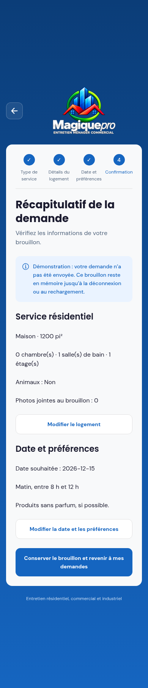

# MagicPro — Projet de fin d’études

**MagicPro (MagiquePro)** est un projet d’application de services d’entretien ménager. Il vise à permettre aux clients de préparer une demande de service, de recevoir une offre et de suivre leurs réservations, avec des espaces distincts pour les clients, les employés et les administrateurs.

Le projet est réalisé en équipe dans **DevConnect**, avec un suivi Scrum dans Jira et des branches de travail sur GitHub.

> **État actuel :** l’application mobile fonctionne avec des données simulées. L’API et le schéma MySQL sont développés séparément ; le mobile n’est pas encore connecté au backend. Les fonctionnalités présentes dans le code ne constituent pas toutes un parcours intégré validé.

## Sommaire

- [Équipe et stories](#équipe-et-stories)
- [Fonctionnalités](#fonctionnalités)
- [Architecture et technologies](#architecture-et-technologies)
- [Organisation du dépôt](#organisation-du-dépôt)
- [Démarrer le mobile](#démarrer-le-mobile)
- [Démarrer le backend](#démarrer-le-backend)
- [Tests et validation](#tests-et-validation)
- [Branches et collaboration](#branches-et-collaboration)
- [Limites et prochaines étapes](#limites-et-prochaines-étapes)

## Équipe et stories

| Membre | Responsabilité | Stories du Sprint 2 |
| --- | --- | --- |
| Maryem Belouaar | Interface client et demande de service | **SCRUM-16** — Interface principale de l’utilisateur |
| Khalid | Interface employeur | **SCRUM-17** — Dashboard employeur |
| Yosri | Écrans d’authentification | **SCRUM-18** — Inscription ; **SCRUM-19** — Mot de passe oublié ; **SCRUM-20** — Confirmation ; **SCRUM-21** — Double authentification |
| Younes Bellouk | Base de données | **SCRUM-22** — Concevoir et développer la base de données |
| Mohamed Nouaoury | API backend | **SCRUM-23** — Créer les routes principales de l’API |

Les branches historiques **SCRUM-6** conservent les premiers travaux de base de données. Les branches **SCRUM-16 à SCRUM-23** correspondent au suivi du Sprint 2. Les attributions ci-dessus décrivent l’organisation de l’équipe ; les statuts de livraison doivent être suivis dans Jira et les Pull Requests.

[Jira DevConnect](https://beelmaryama.atlassian.net/jira/software/projects/SCRUM/boards) · [Branches GitHub](https://github.com/beelmaryama-netizen/projet_fin_detude/branches) · [Pull Requests](https://github.com/beelmaryama-netizen/projet_fin_detude/pulls)

## Fonctionnalités

### Application mobile

- Écran d’accueil public, connexion, inscription, récupération du mot de passe et vérification par code.
- Connexion de démonstration pour les rôles `CLIENT`, `EMPLOYEE` et `ADMIN`.
- Accueil client avec catégories de service, réservations de démonstration et mode clair/sombre.
- Onglets **Accueil**, **Mes demandes**, **Réservations** et **Profil**.
- Parcours résidentiel : **Type de service → Détails du logement → Date et préférences → Récapitulatif**.
- Saisie du logement, superficie en pi², chambres, salles de bain, étages, présence d’animaux et description.
- Sélection de cinq photos maximum, aperçu et suppression.
- Date souhaitée valide, aujourd’hui ou ultérieure, choix matin/après-midi et notes facultatives.
- Récapitulatif modifiable et conservation du brouillon pendant la session.
- Effacement du brouillon à la déconnexion ou au changement de compte.

Le récapitulatif **n’envoie aucune demande**. Les créneaux ne constituent pas une disponibilité confirmée. Les autres catégories ouvrent encore des écrans provisoires. Les boutons Google et Apple simulent une connexion ; ils ne réalisent pas d’authentification OAuth.

### API backend

Le code Express contient des modules d’authentification, utilisateurs, adresses, demandes de service, offres/devis et réservations. Les routes utilisent une validation Zod, une authentification JWT et des contrôles de rôle.

| Module | Principales routes présentes |
| --- | --- |
| État du serveur | `GET /health` |
| Authentification | `POST /api/auth/register`, `/login`, `/refresh`, `/logout`, `/change-password` ; `GET /api/auth/me` |
| Utilisateurs | `PATCH /api/users/me` ; routes administrateur pour créer un employé et gérer les comptes |
| Adresses | `GET`, `POST`, `PATCH`, `DELETE` sous `/api/addresses` |
| Demandes | Liste, détail, création, annulation et changement de statut sous `/api/requests` |
| Offres/devis | Offres d’une demande sous `/api/requests/:requestId/quotes` ; détail, modification, envoi, acceptation et refus sous `/api/quotes` |
| Réservations | Liste et détail sous `/api/appointments` ; notes client, confirmation, report et annulation |

Les permissions varient selon la route : un client accède à ses ressources et un administrateur aux opérations de gestion. Le module de missions des employés reste à développer. Le backend ne fournit pas encore tous les contrats nécessaires aux parcours simulés du mobile, notamment la récupération par code et la connexion sociale.

## Architecture et technologies

| Composant | Technologies |
| --- | --- |
| Mobile | Expo SDK 57, React Native 0.86, React 19, TypeScript |
| Navigation et interface | React Navigation, thème partagé, Poppins et DM Sans |
| Formulaires | React Hook Form et Zod |
| État et actions asynchrones | Zustand et TanStack Query |
| Accès aux photos | Expo ImagePicker |
| API | Node.js, Express 5, JavaScript ESM |
| Base de données | MySQL, Prisma 6 et migrations SQL |
| Authentification backend | JWT, bcrypt et jetons de renouvellement |
| Tests | Vitest côté mobile ; Jest et Supertest côté backend |

Le mobile sépare les écrans, composants, hooks, services, schémas et stores. Le backend sépare les routes, contrôleurs, services, validations et middlewares. Le schéma Prisma représente notamment les utilisateurs, adresses, demandes, détails résidentiels/professionnels, photos, disponibilités, offres et réservations.

## Organisation du dépôt

```text
projet_fin_detude/
├── README.md
├── STRUCTURE_PROJET.md
├── mobile/
│   ├── App.tsx
│   ├── app.json
│   ├── package.json
│   ├── assets/
│   ├── src/
│   │   ├── components/
│   │   ├── features/auth/
│   │   ├── features/client/
│   │   ├── features/requests/
│   │   ├── navigation/
│   │   ├── services/
│   │   ├── store/
│   │   └── theme/
│   ├── stories/
│   └── output/previews/
└── backend/
    ├── package.json
    ├── prisma.config.ts
    ├── prisma/
    │   ├── schema.prisma
    │   ├── migrations/
    │   └── seed.js
    ├── src/
    │   ├── routes/
    │   ├── controllers/
    │   ├── services/
    │   ├── middlewares/
    │   └── validators/
    ├── tests/
    ├── stories/
    └── legacy-nest/
```

`backend/legacy-nest/` conserve une ancienne base NestJS. **L’API principale de `main` est celle d’Express dans `backend/src/`**. Ne pas lancer les deux comme s’il s’agissait du même serveur. Selon la branche choisie, seuls les travaux propres à cette branche peuvent être présents.

## Démarrer le mobile

### Prérequis

- Git et Node.js avec npm. La validation cloud a utilisé **Node.js 24.19.0** et **npm 11.9.0**.
- Pour un téléphone : une version d’Expo Go compatible avec le SDK 57, ou un build de développement compatible.
- Pour le simulateur iOS : macOS et les outils Apple. Pour un émulateur Android : les outils Android correspondants.

```bash
git clone https://github.com/beelmaryama-netizen/projet_fin_detude.git
cd projet_fin_detude/mobile
npm ci
npm start
```

Scanner le QR code Expo sur un appareil compatible. Pour un lancement local, le téléphone et l’ordinateur doivent pouvoir communiquer sur le réseau.

```bash
npm run web      # Version navigateur
npm run android  # Émulateur/appareil Android configuré
npm run ios      # Simulateur iOS sur macOS
```

### Comptes de démonstration

Mot de passe commun : **`MagicPro!2026`**. Code de vérification simulé : **`123456`**.

| Courriel | Rôle | Vérification à la connexion |
| --- | --- | --- |
| `client@magicpro.demo` | CLIENT | Non |
| `verification@magicpro.demo` | CLIENT | Oui |
| `employee@magicpro.demo` | EMPLOYEE | Oui |
| `admin@magicpro.demo` | ADMIN | Oui |

Ces comptes appartiennent au **simulateur mobile**, pas à la base MySQL du backend. Les comptes créés, sessions et brouillons restent en mémoire et disparaissent au rechargement. Utiliser uniquement des données fictives pour cette démonstration.

## Démarrer le backend

### Prérequis et configuration

Le backend nécessite une instance **MySQL accessible**, une base de développement et un utilisateur autorisé à la gérer. Depuis la racine du dépôt :

```bash
cd backend
npm ci
```

Créer localement un fichier **`backend/.env`**, ignoré par Git, et renseigner les variables suivantes. Ne jamais committer les mots de passe ou les clés.

| Variable | Utilisation |
| --- | --- |
| `DATABASE_URL` | URL de connexion Prisma à la base MySQL de développement |
| `JWT_ACCESS_SECRET` | Clé secrète de signature des jetons d’accès |
| `PORT` | Port du serveur ; défaut : `3000` |
| `JWT_ACCESS_EXPIRES` | Durée du jeton d’accès ; défaut : `15m` |
| `REFRESH_TOKEN_DAYS` | Durée du jeton de renouvellement ; défaut : `7` jours |
| `ADMIN_EMAIL`, `ADMIN_PASSWORD` | Valeurs utilisées par le script de création du compte administrateur, si exécuté |

Format attendu pour la connexion : `mysql://<utilisateur>:<mot-de-passe>@<hôte>:3306/<base>`. Remplacer les paramètres par les valeurs de votre environnement. Utiliser une clé JWT aléatoire personnelle.

### Générer le client et préparer la base

Avec `.env` configuré et une base de développement dédiée :

```bash
npx prisma validate
npx prisma generate
npx prisma migrate deploy
npm run dev
```

`prisma migrate deploy` applique les migrations existantes. Pour développer une nouvelle migration sur votre base locale, le script `npm run migrate` lance `prisma migrate dev`.

Le remplissage initial est facultatif : `npx prisma db seed`. Renseigner vos propres `ADMIN_EMAIL` et `ADMIN_PASSWORD` avant cette commande ; le script contient des valeurs de démonstration par défaut.

Contrôle du serveur, dans un autre terminal :

```bash
curl http://localhost:3000/health
# Réponse attendue : {"status":"ok"}
```

Pour lancer sans rechargement automatique : `npm start`. Le démarrage de l’API ne connecte pas automatiquement le mobile : un adaptateur compatible avec les contrats frontend reste nécessaire.

## Tests et validation

### Mobile

Depuis `mobile/` :

```bash
npm run check
# TypeScript, puis Vitest

npx expo export --platform all
# Compilation des bundles web, Android et iOS
```

La dernière validation de la réorganisation a réussi : **32 tests**, contrôle TypeScript et exports des trois plateformes. Les tests couvrent notamment l’authentification simulée, les champs résidentiels, les dates/créneaux, les photos et l’isolation du brouillon entre comptes.

Un export Android/iOS produit des bundles : il ne constitue ni un APK/IPA ni un test sur téléphone. Les nouveaux écrans date/récapitulatif ont aussi été parcourus dans un navigateur avant leur intégration à la branche avec le thème sombre ; l’affichage final sur appareils et la totalité du parcours sombre restent à vérifier.

### Backend

Les tests Jest/Supertest ont besoin d’une **base MySQL de test dédiée**. Créer `backend/.env.test` avec `DATABASE_URL` pointant uniquement vers cette base, `JWT_ACCESS_SECRET` et `NODE_ENV=test`.

> Les helpers de test suppriment les données des tables. Ne jamais utiliser une base de production ou une base partagée contenant des données à conserver.

Depuis `backend/` :

```bash
npx prisma generate
npm run test:db  # Appliquer les migrations sur la base .env.test
npm test
```

Lors de la réorganisation, les dépendances backend ont été installées et les fichiers de l’API de Mohamed ont été comparés : leur contenu a été conservé après déplacement. **Le backend n’a pas été validé à l’exécution** : le téléchargement des moteurs/checksums Prisma était bloqué par le réseau cloud, et aucune connexion MySQL de test n’était configurée. Ne pas désactiver les contrôles de checksum ou TLS pour contourner ce blocage.

## Branches et collaboration

Les dossiers organisent les fichiers ; les **branches Git appartiennent au dépôt entier**. Une branche ne peut pas être placée à l’intérieur d’un dossier.

| Travail | Branches principales |
| --- | --- |
| Version intégrée | `main` |
| Maryem — interface client | `feature/SCRUM-16-interface-utilisateur` |
| Sous-parcours client | `frontend/SCRUM-16-accueil-client`, `frontend/SCRUM-16-demande-service`, `frontend/SCRUM-16-reservations` |
| Khalid — dashboard | `feature/SCRUM-17-dashboard-employeur` |
| Yosri — authentification | `feature/SCRUM-18-inscription`, `feature/SCRUM-19-mot-de-passe-oublie`, `feature/SCRUM-20-confirmation`, `feature/SCRUM-21-double-authentification` |
| Younes — base de données | `feature/SCRUM-22-base-de-donnees` |
| Mohamed — API | `feature/SCRUM-23-routes-backend` |
| Travaux antérieurs | `feature/SCRUM-6-database`, `feature/SCRUM-6-database-schema`, `feature/meryem-espace-employe` |

Pour contribuer :

1. Récupérer les dernières modifications avec `git fetch origin` et choisir la branche de sa story.
2. Modifier les fichiers dans `mobile/` ou `backend/` selon la tâche.
3. Exécuter les vérifications correspondantes.
4. Créer des commits décrivant la modification avec le numéro de story, puis pousser la branche.
5. Ouvrir une Pull Request avec le membre responsable, la story, le comportement ajouté et les vérifications réalisées.

La réorganisation a conservé l’historique des branches. Une story, une branche ou une Pull Request existante ne signifie pas automatiquement que la fonctionnalité est terminée.

## Limites et prochaines étapes

- Connecter les services mobiles aux contrats de l’API et vérifier les réponses reçues.
- Définir la gestion réelle des sessions, jetons, vérifications, récupération de mot de passe et OAuth.
- Terminer les parcours non résidentiels et l’envoi/transfert réel des photos.
- Valider les modules employeur/employé et développer les missions selon les besoins de l’équipe.
- Exécuter la suite backend avec MySQL de test et réaliser les tests d’intégration mobile/API.
- Vérifier sur appareils la galerie, les permissions, le clavier, les zones sûres et l’accessibilité.
- Réévaluer les dépendances avant une livraison ; ce dépôt est un environnement de développement et de démonstration.

### Documentation et aperçus

- [Organisation du dépôt](STRUCTURE_PROJET.md)
- [Guide mobile](mobile/README.md)
- [Livraison du parcours client](mobile/LIVRAISON_CLIENT.md)
- [Analyse du projet](mobile/ANALYSE_MAGICPRO.md)
- [Validation initiale du mobile](mobile/VALIDATION.md)
- [Schéma Prisma](backend/prisma/schema.prisma)
- [Captures des écrans](mobile/output/previews/)

| Date et préférences | Récapitulatif |
| --- | --- |
|  |  |

Ces captures présentent les écrans développés avant la reprise du thème plus récent de la branche SCRUM-16 ; l’apparence actuelle peut différer.
